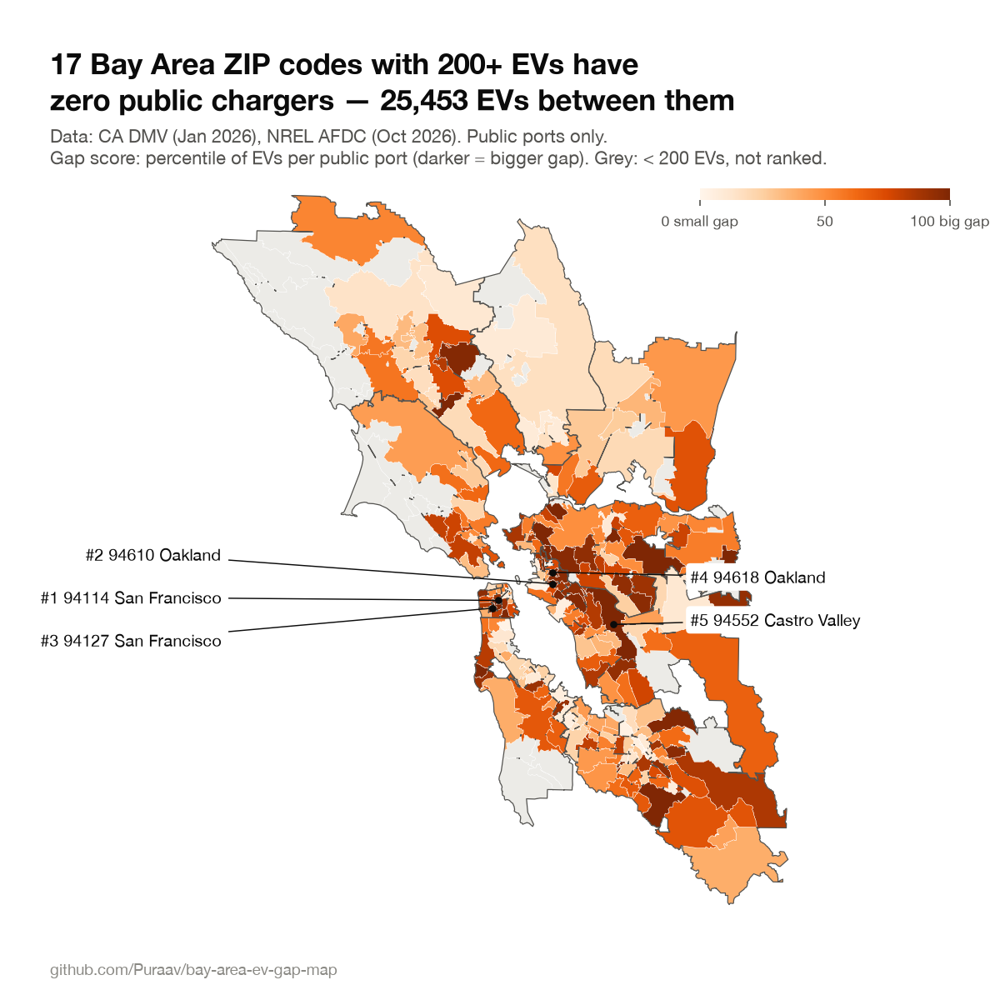
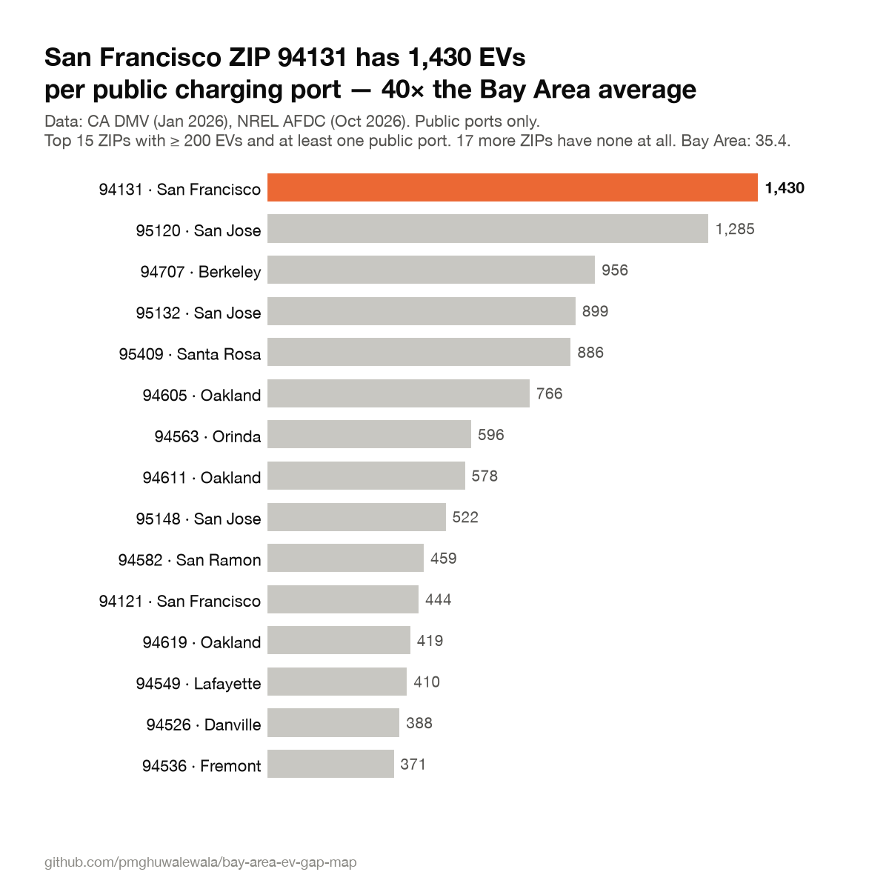
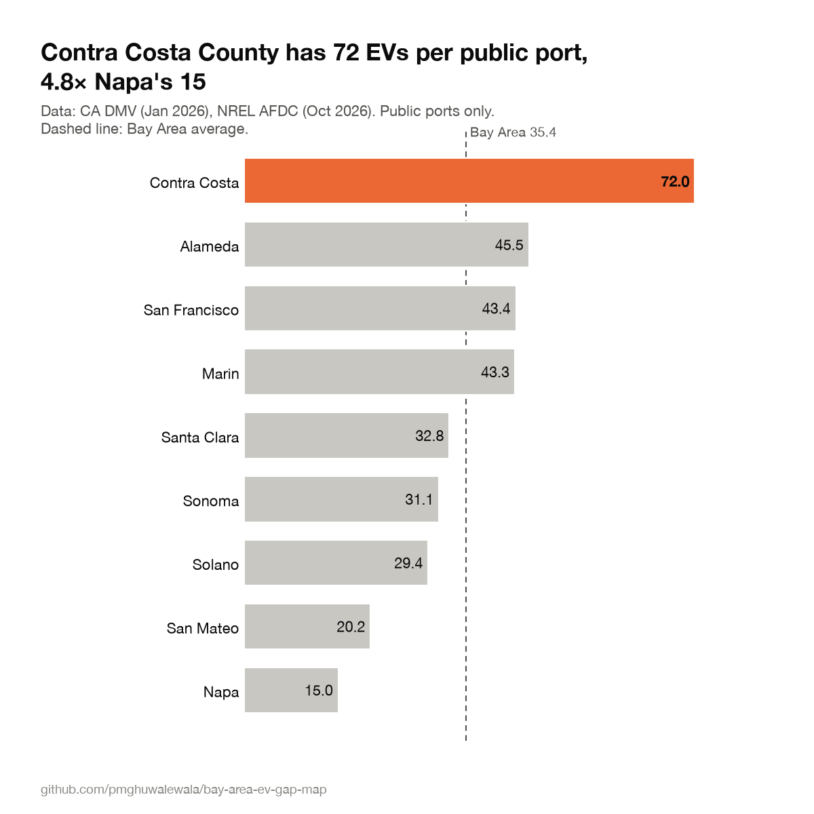

# Bay Area EV Charging Gap Map

**Which Bay Area ZIP codes have the most electric vehicles per public charging port — where are chargers missing?**

[](https://github.com/Puraav/bay-area-ev-gap-map/actions/workflows/ci.yml)

## Headline findings

- **633,018 EVs share 17,869 public charging ports** across the 9-county Bay Area: **35.4 EVs per public port** (13,381 Level 2 + 4,488 DC fast).
- **17 of 234 ZIP codes with 200+ EVs have zero public chargers.** 25,453 EVs are registered in them. The largest is **94114 (San Francisco: Castro / Noe Valley)**, with 3,058 EVs and no public ports.
- **San Francisco 94131 has 1,430 EVs per public port**: 2,859 EVs and 2 ports, **40× the Bay Area average**.
- **Contra Costa County has 72.0 EVs per public port, 4.8× Napa (15.0)**. It's the most under-served county, about twice the Bay Area average.
- **DC fast reality check:** 114 battery EVs per public DC fast port, and **57% of those DC fast ports are Tesla**.
- **Who can't charge at home?** Oakland 94601 ranks first when the gap is combined with the renter share: 1,105 EVs, zero public ports, and **64% of households rent**, so most residents can't install a home charger.
- Fastest-growing under-served ZIP: **94601 (Oakland)**. EVs there grew 59% in two years, and it still has zero public ports.

<sub>Every number above comes from `data/processed/findings.json` (`python -m evgap.findings`).</sub>



Run the interactive map locally with `streamlit run app/streamlit_app.py` (live link coming).

| | |
|---|---|
|  |  |

## What this measures

| Metric | Definition |
|---|---|
| EVs | Battery-electric (BEV) + plug-in hybrid (PHEV) light-duty registrations, 1 Jan 2026 |
| Public ports | Level 2 + DC fast ports at open, public stations (Level 1 excluded) |
| EVs per public port | EVs ÷ public ports; blank (and flagged) when a ZIP has zero ports |
| BEVs per DC fast port | Battery EVs ÷ DC fast ports |
| 2-year EV growth | EVs on 1 Jan 2026 ÷ EVs on 1 Jan 2024 − 1 |
| EV share | EVs ÷ all light-duty vehicles |
| Gap score | Percentile (0–100) of EVs per port among ZIPs with ≥ 200 EVs; zero-port ZIPs = 100 |
| Gap rank | 1 = biggest gap. Zero-port ZIPs first (by EV count), then by EVs per port |
| Renter share | Renter-occupied ÷ occupied housing units (ACS 2020–2024 5-year, table B25003) |
| Priority score | Mean of gap score and renter-share percentile (0–100), for ZIPs with ≥ 200 EVs |

## Data sources

- **EV registrations:** [CA DMV, Vehicle Fuel Type Count by Zip Code](https://data.ca.gov/dataset/vehicle-fuel-type-count-by-zip-code) on data.ca.gov. 1 Jan 2026 file (latest) and 1 Jan 2024 (baseline).
- **Public chargers:** [NREL Alternative Fuel Stations API](https://developer.nlr.gov/docs/transportation/alt-fuel-stations-v1/all/) (AFDC). Open, public, electric stations in California, fetched 2 Oct 2026. NREL is now the National Laboratory of the Rockies, and the API host moved to `developer.nlr.gov`.
- **Geography:** [Census 2020 ZCTA relationship files](https://www.census.gov/geographies/reference-files/time-series/geo/relationship-files.html) (ZCTA ↔ county, ZCTA ↔ place) and [cartographic ZCTA boundaries, 1:500k](https://www.census.gov/geographies/mapping-files/time-series/geo/cartographic-boundary.html). Each ZCTA is assigned to the county it overlaps most by land area, and named after the Census place it overlaps most.
- **Renters:** [ACS 5-year table B25003](https://www.census.gov/programs-surveys/acs/data/summary-file.html) (2020–2024), by ZCTA, from the keyless table-based summary file (`python -m evgap.fetch --with-acs`).

## Limitations

- DMV registrations are a 1 Jan 2026 snapshot by owner ZIP, not where cars charge; commuters charge near work.
- NREL lists public ports; it doesn't show pricing, reliability, downtime or utilization.
- ZIP codes and Census ZCTAs don't match perfectly.
- Tesla Superchargers count as DC fast ports; many are Tesla-first, so non-Tesla drivers may see a bigger gap.
- Home and workplace charging isn't counted. Areas with many single-family homes need fewer public chargers.

Also note: a few ZIPs contain corporate HQs, and their counts likely include fleet registrations. The clearest case is 94304 (Palo Alto), up 778% in two years.

## Run it yourself

```bash
python3.11 -m venv .venv && source .venv/bin/activate
pip install -e ".[dev]"
cp .env.example .env            # add your free key from https://developer.nlr.gov/signup/
python -m evgap.fetch --with-acs && python -m evgap.build && python -m evgap.findings
streamlit run app/streamlit_app.py
```

`python -m evgap.charts` regenerates the PNGs, and `pytest -q` runs the checks. The app and tests run from committed processed files, so you can skip fetch/build if you only want to explore.

## Project structure

```
src/evgap/
  config.py      paths, county FIPS, thresholds
  fetch.py       download DMV, NREL, Census inputs → data/raw/
  build.py       ZIP + county metrics → data/processed/
  findings.py    headline numbers → findings.json
  charts.py      PNGs → charts/
app/streamlit_app.py   interactive map, rankings, ZIP detail
tests/test_build.py    data-integrity and unit tests (CI on every push)
data/processed/        zip_metrics.csv, county_metrics.csv, bay_area_zcta.geojson (committed)
```

## Why I built this

I studied computer science in San Francisco and recently moved back to India. While researching EV charging as a business idea, I wanted to see with real data where public chargers are actually missing in the Bay Area, and how San Francisco compares with Mumbai.

## License

MIT © Puraav Ghuwalewala
